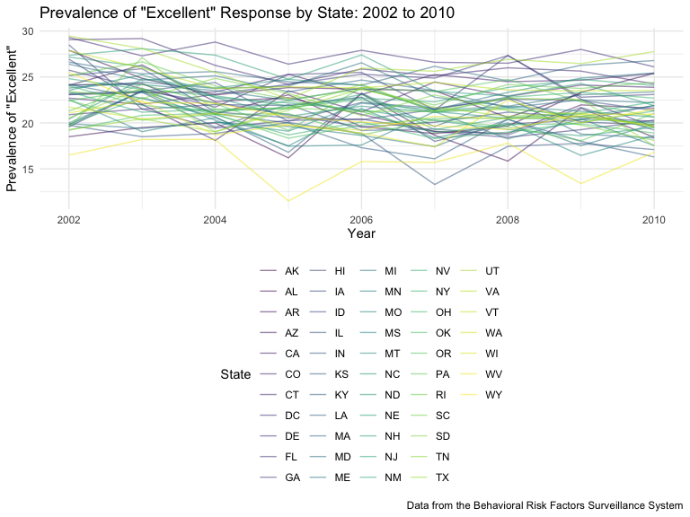
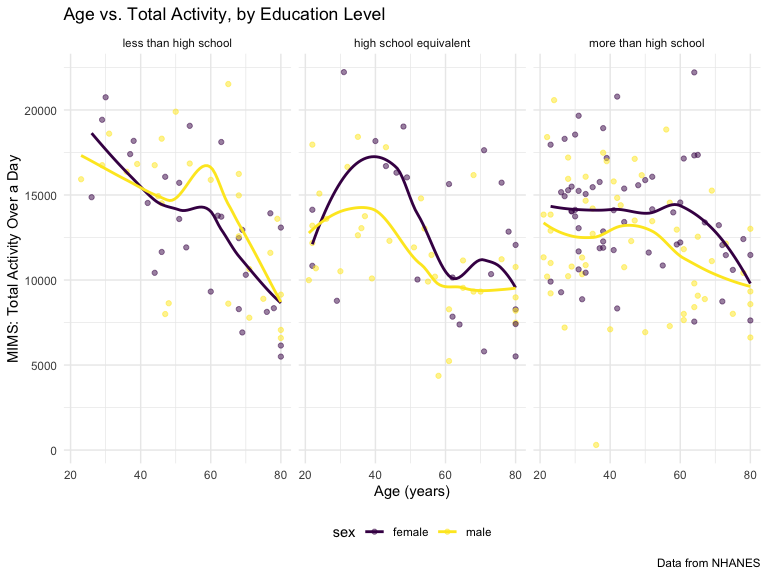

P8105 Homework 3
================
2023-10-10

This homework includes figures; the readability of embedded plots
(e.g. font sizes, axis labels, titles) will be assessed!

# Library Setup

Loading the `tidyverse` and `p8105 datasets` libraries for later use.
Also establishing some document-wide theme and visualization output
settings.

# Problem 1

## Reading in Dataset

``` r
data("instacart")

instacart = 
  as_tibble(instacart)
```

## Describing the `instacart` dataset

The `instacart` dataset has 1384617 observations and 15 variables. It
contains information about the items in instacart orders from 131209
different individuals in 2017. The dataset includes variables with
details about the user placing the order, the date and time of the order
itself, and specifics on the items being ordered, including their name
and physical and department location in the store. In total, there are
39123 separate products included in the dataset. On average, each order
was placed 17 days after that individual’s prior order. 59.86% of
products were reordered.

## Creating Table of Most Commonly Used Aisles

To see how many aisles there are, and which aisles have the most items
ordered from them, we can create a table. Below is a table summarizing
the number of items ordered from aisle.

``` r
instacart |> 
  count(aisle) |> 
  arrange(desc(n))
```

    ## # A tibble: 134 × 2
    ##    aisle                              n
    ##    <chr>                          <int>
    ##  1 fresh vegetables              150609
    ##  2 fresh fruits                  150473
    ##  3 packaged vegetables fruits     78493
    ##  4 yogurt                         55240
    ##  5 packaged cheese                41699
    ##  6 water seltzer sparkling water  36617
    ##  7 milk                           32644
    ##  8 chips pretzels                 31269
    ##  9 soy lactosefree                26240
    ## 10 bread                          23635
    ## # ℹ 124 more rows

In total, there are 134 aisles, and the two most commonly ordered-from
aisles are fresh vegetables and fresh fruits.

## Plotting Items Ordered from Each Aisle

Now, generating a plot displaying the number of items ordered from each
aisle, limited to aisles with more than 10,000 items ordered. We can do
this by filtering the dataset based on order count. Arranging the plot
by number of orders so that the aisles generate a nice curve.

``` r
instacart |> 
  count(aisle) |> 
  filter(n > 10000) |> 
  mutate(
    aisle = fct_reorder(aisle, n)
  ) |> 
  ggplot(aes(x = aisle, y = n)) + 
  geom_point() + 
  labs(
    title = "Total number of items ordered from each aisle",
    x = "Aisle",
    y = "Item count"
  ) +
  theme(axis.text.x = element_text(angle = 60, hjust = 1))
```


As the plot reveals, the majority of aisles have less than 40,000 items
ordered, and the most popular aisles of fresh vegetables and fresh
fruits have more than 3 times that number.

## Creating Table of Popular Baking, Dog Food, and Vegetable Items

Creating a table displaying the 3 most popular items in the “baking
ingredients”, “dog food care”, and “packaged vegetables fruits” aisles,
and how often each item is ordered. Doing this by filtering to only
include items from the 3 categories of interest, then counting up how
many times each item was ordered. Then, I created a new `rank` variable
of each item’s place in the ranking for its category, and limited the
table to items with rank 1-3.

``` r
instacart |> 
  filter(aisle %in% c("baking ingredients", "dog food care", "packaged vegetables fruits")) |> 
  group_by(aisle) |> 
  count(product_name) |> 
  mutate(
    rank = min_rank(desc(n))
  ) |> 
  filter(rank < 4) |> 
  arrange(desc(n)) |> 
  knitr::kable()
```

| aisle                      | product_name                                  |    n | rank |
|:---------------------------|:----------------------------------------------|-----:|-----:|
| packaged vegetables fruits | Organic Baby Spinach                          | 9784 |    1 |
| packaged vegetables fruits | Organic Raspberries                           | 5546 |    2 |
| packaged vegetables fruits | Organic Blueberries                           | 4966 |    3 |
| baking ingredients         | Light Brown Sugar                             |  499 |    1 |
| baking ingredients         | Pure Baking Soda                              |  387 |    2 |
| baking ingredients         | Cane Sugar                                    |  336 |    3 |
| dog food care              | Snack Sticks Chicken & Rice Recipe Dog Treats |   30 |    1 |
| dog food care              | Organix Chicken & Brown Rice Recipe           |   28 |    2 |
| dog food care              | Small Dog Biscuits                            |   26 |    3 |

## Creating Table of Mean Purchase Time of Apples and Ice Cream

Making a table of the mean time when Pink Lady apples and coffee ice
cream are ordered, per day of the week. Because I want to make the table
easily readable for humans, I will use `pivot_wider` to make it “untidy”
and have each day of the week in a different column.

``` r
instacart |>
  filter(product_name %in% c("Pink Lady Apples", "Coffee Ice Cream")) |>
  group_by(product_name, order_dow) |>
  summarize(avg_hour = mean(order_hour_of_day)) |>
  pivot_wider(
    names_from = order_dow, 
    values_from = avg_hour
  ) |>
  knitr::kable(digits = 2)
```

    ## `summarise()` has grouped output by 'product_name'. You can override using the
    ## `.groups` argument.

| product_name     |     0 |     1 |     2 |     3 |     4 |     5 |     6 |
|:-----------------|------:|------:|------:|------:|------:|------:|------:|
| Coffee Ice Cream | 13.77 | 14.32 | 15.38 | 15.32 | 15.22 | 12.26 | 13.83 |
| Pink Lady Apples | 13.44 | 11.36 | 11.70 | 14.25 | 11.55 | 12.78 | 11.94 |

From the table, we can see that coffee ice cream is most often purchased
between noon and 4pm, while pink lady apples are typically ordered from
11am to 3pm.

# Problem 2

## Reading in Dataset

``` r
data("brfss_smart2010")

brfss = 
  as_tibble(brfss_smart2010) |> 
  janitor::clean_names()
```

## Cleaning the `brfss` Dataset

Cleaning up the dataset ahead of analysis:

- Filtering to only include responses to questions from the “Overall
  Health” topic
- Filtering to include responses ranging from “Excellent” to “Poor”.
  These responses have values between 1 and 5 for the`display_order`
  variable, so filtering to only include those values and exclude
  observations that are missing a `response` variable value
- Renaming variables to more clearly define their contents
- Organizing `responses` as a factor taking levels ordered from “Poor”
  to “Excellent”

``` r
brfss =
  rename(brfss,
    state = locationabbr, 
    county = locationdesc, 
    response_count = sample_size, 
    response_prevalence = data_value, 
    response_rank = display_order,
    response_id = respid
  ) |> 
  filter(topic == "Overall Health" & response_rank <= 5 ) |> 
  mutate(
    response = factor(response, 
                      levels = c("Poor", "Fair", "Good", "Very Good", "Excellent"),
                      ordered = TRUE)
  )
```

# States Observed at 7 or More Locations

In 2002, which states were observed at 7 or more locations? What about
in 2010?

``` r
brfss |> 
  filter(year == 2002) |>
  group_by(state) |> 
  select(county) |> 
  distinct() |> 
  count() |> 
  arrange(desc(n)) |> 
  filter(n >= 7)
```

    ## Adding missing grouping variables: `state`

    ## # A tibble: 6 × 2
    ## # Groups:   state [6]
    ##   state     n
    ##   <chr> <int>
    ## 1 PA       10
    ## 2 MA        8
    ## 3 NJ        8
    ## 4 CT        7
    ## 5 FL        7
    ## 6 NC        7

``` r
brfss |> 
  filter(year == 2010) |> 
  group_by(state) |> 
  select(county) |> 
  distinct() |> 
  count() |> 
  arrange(desc(n)) |> 
  filter(n >= 7)
```

    ## Adding missing grouping variables: `state`

    ## # A tibble: 14 × 2
    ## # Groups:   state [14]
    ##    state     n
    ##    <chr> <int>
    ##  1 FL       41
    ##  2 NJ       19
    ##  3 TX       16
    ##  4 CA       12
    ##  5 MD       12
    ##  6 NC       12
    ##  7 NE       10
    ##  8 WA       10
    ##  9 MA        9
    ## 10 NY        9
    ## 11 OH        8
    ## 12 CO        7
    ## 13 PA        7
    ## 14 SC        7

In 2002, these 6 states were observed at 7 or more locations: PA, MA,
NJ, CT, FL, NC.

In comparison, in 2010, these 14 states were observed at 7 or more
locations: FL, NJ, TX, CA, MD, NC, NE, WA, MA, NY, OH, CO, PA, SC.

8 additional states were observed at 7 or more locations in 2010
compared to 2002. Of those observed in 2002, only Connecticut wasn’t
similarly observed at 7 or more locations in 2010.

# Plotting Prevalence of Excellent Responses Across State Locations

Constructing a dataset that is limited to Excellent responses, and
contains, year, state, and a variable that averages the data_value
across locations within a state.

``` r
brfss_excellent =
  filter(brfss, response == "Excellent") |> 
  group_by(year, state) |> 
  mutate(
    avg_excellence = mean(response_prevalence, na.rm = TRUE)
  ) |> 
  select(year, state, avg_excellence) |> 
  group_by(year) |> 
  distinct(state, .keep_all = TRUE)
```

Make a “spaghetti” plot of this average value over time within a state
(that is, make a plot showing a line for each state across years – the
geom_line geometry and group aesthetic will help).

``` r
ggplot(brfss_excellent, aes(x = year, y = avg_excellence, group = state, color = state)) +
  geom_line(alpha = .5) +
  labs(
    title = 'Prevalence of "Excellent" Response by State: 2002 to 2010',
    x = "Year",
    y = 'Prevalence of "Excellent"',
    color = "State",
    caption = "Data from the Behavioral Risk Factors Surveillance System"
  )
```



From the spaghetti plot, we can see that West Virginia consistently has
the lowest, if not nearly the lowest, average prevalence of “Excellent”
responses to questions asking about overall health. In contrast, DC and
Connecticut are generally in the top of the pack for prevalence of
“Excellent” responses. Across the country as a whole, it appears that
there’s a slight decline in the prevalence of “Excellent” responses from
2002 to 2010.

# Plotting Distribution of Responses in NY State in 2006 and 2010

Make a two-panel plot showing, for the years 2006, and 2010,
distribution of data_value for responses (“Poor” to “Excellent”) among
locations in NY State.

``` r
brfss |> 
  filter(year %in% c(2006, 2010) & state == "NY") |> 
  drop_na(response) |> 
  ggplot(aes(x = response, y = response_prevalence)) +
  geom_boxplot() +
  facet_grid(. ~ year) +
  labs(
    title = "Distribution of NY State Responses in 2006 and 2010",
    x = "Response",
    y = "Prevalence",
    caption = "Data from the Behavioral Risk Factors Surveillance System"
  ) 
```


# Problem 3

Accelerometers can measure MIMS in a short period; one-minute intervals
are common. Because accelerometers can be worn comfortably and
unobtrusively, they produce around-the-clock observations. This problem
uses accelerometer data collected on 250 participants in the NHANES
study. Variables MIMS are the MIMS values for each minute of a 24-hour
day starting at midnight.

## Reading in Dataset

``` r
mims_accel = 
  read_csv("Data/nhanes_accel.csv") |> 
  as_tibble() |> 
  janitor::clean_names()
```

    ## Rows: 250 Columns: 1441
    ## ── Column specification ────────────────────────────────────────────────────────
    ## Delimiter: ","
    ## dbl (1441): SEQN, min1, min2, min3, min4, min5, min6, min7, min8, min9, min1...
    ## 
    ## ℹ Use `spec()` to retrieve the full column specification for this data.
    ## ℹ Specify the column types or set `show_col_types = FALSE` to quiet this message.

``` r
mims_covar = 
  read_csv("Data/nhanes_covar.csv", skip = 4) |> 
  as_tibble() |> 
  janitor::clean_names()
```

    ## Rows: 250 Columns: 5
    ## ── Column specification ────────────────────────────────────────────────────────
    ## Delimiter: ","
    ## dbl (5): SEQN, sex, age, BMI, education
    ## 
    ## ℹ Use `spec()` to retrieve the full column specification for this data.
    ## ℹ Specify the column types or set `show_col_types = FALSE` to quiet this message.

## Cleaning the `brfss` Dataset

Tidying and merging the two datasets. Specifically:

- Maintaining all originally observed variables

- Excluding participants younger than 21 years old

- Recoding the `sex` and `education` variables to be factors, with the
  latter being ordered

- “Tidying” the `mim_accel` dataset using `pivot_longer` so that each
  minute is its own row

- Merging the two datasets such that any participant without demographic
  data (aka. being in the `mims_covar` dataset) isn’t included in the
  final dataset

- Exclude participants missing demographic data - DISCUSSION BOARD
  QUESTION RE. THIS

``` r
mims_covar_clean = 
  filter(mims_covar, age >= 21) |> 
  mutate(
    sex = as.factor(case_match(sex,
                               1 ~"male",
                               2 ~ "female")),
    education = as.factor(case_match(education,
                                     1 ~ "less than high school",
                                     2 ~ "high school equivalent",
                                     3 ~ "more than high school")),
    education = factor(education, 
                       levels = c("less than high school", "high school equivalent", "more than high school"),
                       ordered = TRUE)
  )
```

``` r
mims_accel_clean = 
  pivot_longer(
    mims_accel, 
    starts_with("min"),
    names_to = "minute",
    names_prefix = "min",
    values_to = "mims")
```

``` r
mims_merged = 
  left_join(mims_covar_clean, mims_accel_clean, by = "seqn")
```

## Visualizing the Age Distributions of Education Categories, by Sex

Producing a table of the number of men and women in each education
category. Because I want to make this table easily readable for humans,
I’m using `pivot_wider` to make it “untidy” and have the sexes in
different columns.

``` r
mims_covar_clean |> 
  group_by(education, sex) |> 
  count() |> 
  pivot_wider(
    names_from = sex,
    values_from = n
  ) |> 
  knitr::kable(digits = 2)
```

| education              | female | male |
|:-----------------------|-------:|-----:|
| less than high school  |     29 |   28 |
| high school equivalent |     23 |   36 |
| more than high school  |     59 |   56 |

Create a visualization of the age distributions for men and women in
each education category. Comment on these items.

``` r
mims_covar_clean |> 
  ggplot(aes(x = education, y = age, color = sex)) +
  geom_boxplot() +
  labs(
    title = "Age Distributions in Education Categories, by Sex",
    x = "Level of Education",
    y = "Age (years)",
    caption = "Data from NHANES"
  ) 
```



## Plotting Total Activity and Age, by Sex and Education

Traditional analyses of accelerometer data focus on the total activity
over the day. Using your tidied dataset, aggregate across minutes to
create a total activity variable for each participant. Plot these total
activities (y-axis) against age (x-axis); your plot should compare men
to women and have separate panels for each education level. Include a
trend line or a smooth to illustrate differences. Comment on your plot.

## Plotting Activity Time Courses, by Education

Accelerometer data allows the inspection activity over the course of the
day. Make a three-panel plot that shows the 24-hour activity time
courses for each education level and use color to indicate sex. Describe
in words any patterns or conclusions you can make based on this graph;
including smooth trends may help identify differences.
