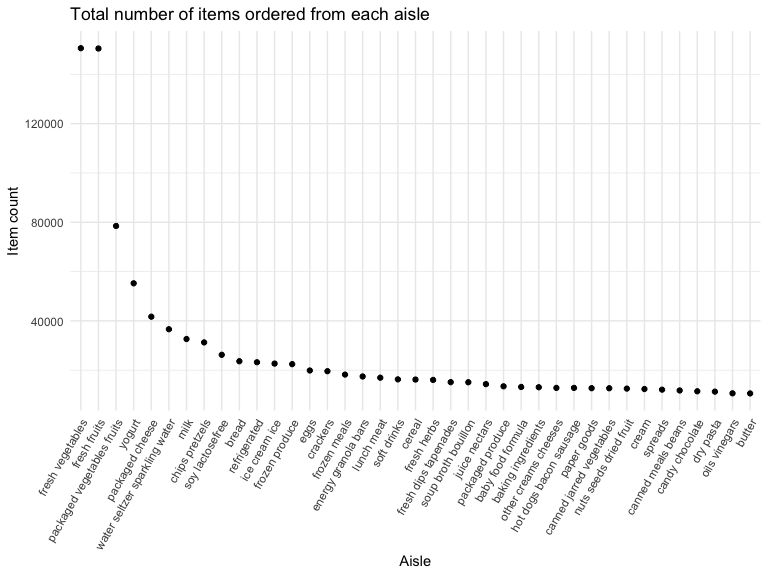
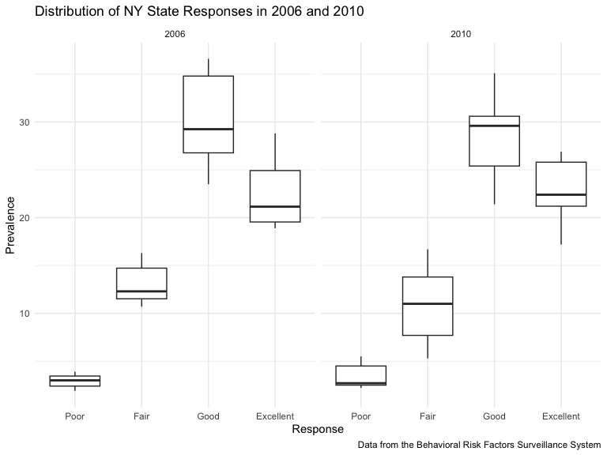
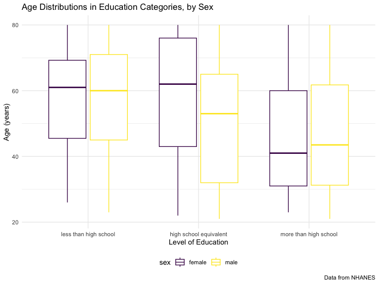
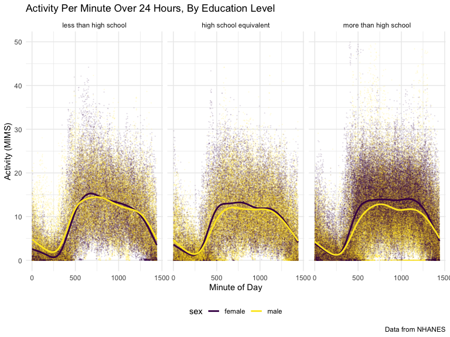

P8105 Homework 3
================
2023-10-10

## Library Setup

Loading the `patchwork`, `p8105 datasets`, and `tidyverse` libraries for
later use.

``` r
library(tidyverse)
```

    ## ── Attaching core tidyverse packages ──────────────────────── tidyverse 2.0.0 ──
    ## ✔ dplyr     1.1.3     ✔ readr     2.1.4
    ## ✔ forcats   1.0.0     ✔ stringr   1.5.0
    ## ✔ ggplot2   3.4.3     ✔ tibble    3.2.1
    ## ✔ lubridate 1.9.2     ✔ tidyr     1.3.0
    ## ✔ purrr     1.0.2     
    ## ── Conflicts ────────────────────────────────────────── tidyverse_conflicts() ──
    ## ✖ dplyr::filter() masks stats::filter()
    ## ✖ dplyr::lag()    masks stats::lag()
    ## ℹ Use the conflicted package (<http://conflicted.r-lib.org/>) to force all conflicts to become errors

``` r
library(p8105.datasets)
library(patchwork)
library(tidyverse)
```

# Problem 1

## Reading in Data

``` r
data("instacart")

instacart = 
  as_tibble(instacart)
```

## Describing the `instacart` Dataset

The `instacart` dataset has 1384617 observations and 15 variables. It
contains information about the items in instacart orders from 131209
different individuals in 2017. The dataset includes variables with
details about the user placing the order, the date and time of the order
itself, and specifics on the items being ordered, including their name,
departmental-association, and department location in the store. In
total, there are 39123 separate products included in the dataset. On
average, orders were placed 17 days after the orderer’s prior
transaction. 59.86% of products were reordered.

## Most Commonly Used Aisles

Creating a table to visualize the number of aisles and the total number
of items ordered from each aisle, arranged with the most popular aisles
first.

``` r
instacart |> 
  count(aisle) |> 
  arrange(desc(n)) |> 
  knitr::kable(caption = "Most Commonly Ordered-from Aisles")
```

| aisle                         |      n |
|:------------------------------|-------:|
| fresh vegetables              | 150609 |
| fresh fruits                  | 150473 |
| packaged vegetables fruits    |  78493 |
| yogurt                        |  55240 |
| packaged cheese               |  41699 |
| water seltzer sparkling water |  36617 |
| milk                          |  32644 |
| chips pretzels                |  31269 |
| soy lactosefree               |  26240 |
| bread                         |  23635 |
| refrigerated                  |  23228 |
| ice cream ice                 |  22676 |
| frozen produce                |  22453 |
| eggs                          |  19875 |
| crackers                      |  19592 |
| frozen meals                  |  18221 |
| energy granola bars           |  17449 |
| lunch meat                    |  16957 |
| soft drinks                   |  16279 |
| cereal                        |  16201 |
| fresh herbs                   |  16052 |
| fresh dips tapenades          |  15142 |
| soup broth bouillon           |  15109 |
| juice nectars                 |  14350 |
| packaged produce              |  13460 |
| baby food formula             |  13198 |
| baking ingredients            |  13088 |
| other creams cheeses          |  12820 |
| hot dogs bacon sausage        |  12813 |
| paper goods                   |  12694 |
| canned jarred vegetables      |  12679 |
| nuts seeds dried fruit        |  12532 |
| cream                         |  12356 |
| spreads                       |  12102 |
| canned meals beans            |  11774 |
| candy chocolate               |  11453 |
| dry pasta                     |  11298 |
| oils vinegars                 |  10620 |
| butter                        |  10575 |
| cookies cakes                 |   9980 |
| instant foods                 |   9917 |
| breakfast bakery              |   9851 |
| condiments                    |   9743 |
| pasta sauce                   |   9736 |
| frozen breakfast              |   9729 |
| tea                           |   9376 |
| spices seasonings             |   9279 |
| frozen appetizers sides       |   8870 |
| coffee                        |   8392 |
| tortillas flat bread          |   8353 |
| missing                       |   8251 |
| frozen pizza                  |   7661 |
| asian foods                   |   7007 |
| popcorn jerky                 |   6917 |
| fruit vegetable snacks        |   6741 |
| hot cereal pancake mixes      |   6352 |
| grains rice dried goods       |   6134 |
| cleaning products             |   5894 |
| packaged poultry              |   5608 |
| poultry counter               |   5208 |
| preserved dips spreads        |   5188 |
| tofu meat alternatives        |   5123 |
| buns rolls                    |   5054 |
| pickled goods olives          |   4882 |
| doughs gelatins bake mixes    |   4758 |
| energy sports drinks          |   4742 |
| frozen vegan vegetarian       |   4727 |
| salad dressing toppings       |   4719 |
| laundry                       |   4636 |
| prepared meals                |   4133 |
| canned fruit applesauce       |   3996 |
| specialty cheeses             |   3873 |
| dish detergents               |   3870 |
| granola                       |   3803 |
| latino foods                  |   3548 |
| frozen meat seafood           |   3341 |
| canned meat seafood           |   3241 |
| meat counter                  |   3159 |
| breakfast bars pastries       |   3144 |
| oral hygiene                  |   3070 |
| prepared soups salads         |   2936 |
| food storage                  |   2906 |
| marinades meat preparation    |   2905 |
| cat food care                 |   2885 |
| honeys syrups nectars         |   2864 |
| soap                          |   2773 |
| body lotions soap             |   2137 |
| vitamins supplements          |   1969 |
| plates bowls cups flatware    |   1959 |
| beers coolers                 |   1839 |
| other                         |   1795 |
| refrigerated pudding desserts |   1729 |
| fresh pasta                   |   1628 |
| trash bags liners             |   1621 |
| dog food care                 |   1612 |
| protein meal replacements     |   1612 |
| frozen breads doughs          |   1532 |
| packaged meat                 |   1526 |
| bakery desserts               |   1501 |
| hair care                     |   1469 |
| trail mix snack mix           |   1463 |
| cold flu allergy              |   1346 |
| red wines                     |   1243 |
| digestion                     |   1205 |
| diapers wipes                 |   1109 |
| baking supplies decor         |   1094 |
| white wines                   |   1088 |
| seafood counter               |   1084 |
| air fresheners candles        |   1067 |
| cocoa drink mixes             |   1062 |
| feminine care                 |   1048 |
| spirits                       |    967 |
| mint gum                      |    962 |
| frozen dessert                |    922 |
| packaged seafood              |    909 |
| muscles joints pain relief    |    897 |
| more household                |    891 |
| deodorants                    |    858 |
| facial care                   |    746 |
| bulk dried fruits vegetables  |    725 |
| indian foods                  |    719 |
| bulk grains rice dried goods  |    634 |
| kosher foods                  |    628 |
| eye ear care                  |    548 |
| first aid                     |    539 |
| skin care                     |    534 |
| shave needs                   |    532 |
| ice cream toppings            |    504 |
| specialty wines champagnes    |    461 |
| kitchen supplies              |    448 |
| baby bath body care           |    328 |
| baby accessories              |    306 |
| frozen juice                  |    294 |
| beauty                        |    287 |

Most Commonly Ordered-from Aisles

In total, there are 134 aisles, and the two most commonly ordered-from
aisles are fresh vegetables and fresh fruits.

## Plotting Items Ordered from Each Aisle

Now, generating a plot displaying the number of items ordered from each
aisle, limited to aisles with more than 10,000 items ordered. Arranging
the plot by number of orders so that the aisles generate a nice curve.

``` r
instacart |> 
  count(aisle) |> 
  filter(n > 10000) |> 
  mutate(
    aisle = fct_reorder(aisle, desc(n))
  ) |> 
  ggplot(aes(x = aisle, y = n)) + 
  geom_point() + 
  labs(
    title = "Total number of items ordered from each aisle",
    x = "Aisle",
    y = "Item count"
  ) +
  theme(axis.text.x = element_text(angle = 60, hjust = 1))
```



As the plot reveals, the majority of aisles have less than 40,000 items
ordered, while the most popular aisles of fresh vegetables and fresh
fruits have more than 3 times that number of item ordered.

## Popular Items From the Baking, Dog Food, and Fruits/Vegetable Aisles

Creating a table displaying the 3 most popular items in the “baking
ingredients”, “dog food care”, and “packaged vegetables fruits” aisles,
and how often each item is ordered. Doing this by filtering to only
include items from the 3 categories of interest, then counting up how
many times each item was ordered. Then, I created a new `rank` variable
of each item’s place in the ranking for its category, and limited the
table to items with rank 1-3.

``` r
instacart |> 
  filter(aisle %in% c("baking ingredients", "dog food care", "packaged vegetables fruits")) |> 
  group_by(aisle) |> 
  count(product_name) |> 
  mutate(
    rank = min_rank(desc(n))
  ) |> 
  filter(rank < 4) |> 
  arrange(desc(n)) |> 
  knitr::kable(caption = "Most Popular Baking, Dog Food, and Packaged Fruits/Vegetables Items" )
```

| aisle                      | product_name                                  |    n | rank |
|:---------------------------|:----------------------------------------------|-----:|-----:|
| packaged vegetables fruits | Organic Baby Spinach                          | 9784 |    1 |
| packaged vegetables fruits | Organic Raspberries                           | 5546 |    2 |
| packaged vegetables fruits | Organic Blueberries                           | 4966 |    3 |
| baking ingredients         | Light Brown Sugar                             |  499 |    1 |
| baking ingredients         | Pure Baking Soda                              |  387 |    2 |
| baking ingredients         | Cane Sugar                                    |  336 |    3 |
| dog food care              | Snack Sticks Chicken & Rice Recipe Dog Treats |   30 |    1 |
| dog food care              | Organix Chicken & Brown Rice Recipe           |   28 |    2 |
| dog food care              | Small Dog Biscuits                            |   26 |    3 |

Most Popular Baking, Dog Food, and Packaged Fruits/Vegetables Items

From the table, we can see that the most popular items in each category
are organic baby spinach, light brown sugar, and chicken and rice dog
treats, respectively. However, the fruits/vegetables aisle is much more
popular than the others, with baby spinach having been ordered more than
300 times the amount that the dog treats were ordered.

## Mean Purchase Time of Apples and Ice Cream

Making a table of the mean time when Pink Lady apples and coffee ice
cream are ordered, per day of the week. To make the plot easily readable
for humans, using `pivot_wider` to make each day of the week a different
column.

``` r
instacart |>
  filter(product_name %in% c("Pink Lady Apples", "Coffee Ice Cream")) |>
  group_by(product_name, order_dow) |>
  summarize(avg_hour = mean(order_hour_of_day)) |>
  pivot_wider(
    names_from = order_dow, 
    values_from = avg_hour
  ) |>
  knitr::kable(digits = 2, caption = "Average Purchase Time Per Day of the Week")
```

    ## `summarise()` has grouped output by 'product_name'. You can override using the
    ## `.groups` argument.

| product_name     |     0 |     1 |     2 |     3 |     4 |     5 |     6 |
|:-----------------|------:|------:|------:|------:|------:|------:|------:|
| Coffee Ice Cream | 13.77 | 14.32 | 15.38 | 15.32 | 15.22 | 12.26 | 13.83 |
| Pink Lady Apples | 13.44 | 11.36 | 11.70 | 14.25 | 11.55 | 12.78 | 11.94 |

Average Purchase Time Per Day of the Week

From the table, we can see that coffee ice cream is most often purchased
between noon and 4pm, while pink lady apples are typically ordered from
11am to 3pm. The apples are typically purchased latest on day 3, while
the ice cream is typically ordered latest on day 2.

# Problem 2

## Reading in Data

``` r
data("brfss_smart2010")

brfss = 
  as_tibble(brfss_smart2010) |> 
  janitor::clean_names()
```

## Cleaning the `brfss` Dataset

Cleaning up the dataset ahead of analysis:

- Filtering to only include responses to questions from the “Overall
  Health” topic
- Filtering to include responses ranging from “Excellent” to “Poor”.
  These responses have values between 1 and 5 for the `response_rank`
  variable, so specifically filtering out `response_rank` values \> 5
- Renaming variables to more clearly define their contents
- Organizing `responses` as a factor variable with levels ordered from
  “Poor” to “Excellent”

``` r
brfss =
  rename(brfss,
    state = locationabbr, 
    county = locationdesc, 
    response_count = sample_size, 
    response_prevalence = data_value, 
    response_rank = display_order,
    response_id = respid
  ) |> 
  filter(topic == "Overall Health" & response_rank <= 5) |> 
  mutate(
    response = factor(response, 
                      levels = c("Poor", "Fair", "Good", "Very Good", "Excellent"),
                      ordered = TRUE)
  )
```

## Describing the `brfss` Dataset

The `brfss` dataset has 10625 observations and 23 variables. It contains
information about health status and risk factors from a continuous,
state-based surveillance system, with observations from 2002 to 2010.
The dataset includes variables such as the state and county of
observation, the prevalence of each response option (“Excellent”, “Very
Good”, “Good”, “Fair”, and “Poor”) per question, and the
latitude/longitude of observation sites. In total, there are 404
observation sites included in the dataset.

# States Observed at 7 or More Locations

Identifying the states observed at 7 or more locations in 2002 and 2010.
Doing this by filtering to the year of interest, then counting the
number of distinct counties observed for each state. Then, arranging the
states and associated counts in descending order, and selecting only
those with a count of 7 or greater.

``` r
brfss |> 
  filter(year == 2002) |>
  group_by(state) |> 
  select(county) |> 
  distinct() |> 
  count() |> 
  arrange(desc(n)) |> 
  filter(n >= 7) |> 
  knitr::kable(caption = "Number of Observation Sites in 2002")
```

    ## Adding missing grouping variables: `state`

| state |   n |
|:------|----:|
| PA    |  10 |
| MA    |   8 |
| NJ    |   8 |
| CT    |   7 |
| FL    |   7 |
| NC    |   7 |

Number of Observation Sites in 2002

``` r
brfss |> 
  filter(year == 2010) |> 
  group_by(state) |> 
  select(county) |> 
  distinct() |> 
  count() |> 
  arrange(desc(n)) |> 
  filter(n >= 7) |> 
  knitr::kable(caption = "Number of Observation Sites in 2010")
```

    ## Adding missing grouping variables: `state`

| state |   n |
|:------|----:|
| FL    |  41 |
| NJ    |  19 |
| TX    |  16 |
| CA    |  12 |
| MD    |  12 |
| NC    |  12 |
| NE    |  10 |
| WA    |  10 |
| MA    |   9 |
| NY    |   9 |
| OH    |   8 |
| CO    |   7 |
| PA    |   7 |
| SC    |   7 |

Number of Observation Sites in 2010

In 2002, these 6 states were observed at 7 or more locations: PA, MA,
NJ, CT, FL, NC.

In comparison, in 2010, these 14 states were observed at 7 or more
locations: FL, NJ, TX, CA, MD, NC, NE, WA, MA, NY, OH, CO, PA, SC.

8 additional states were observed at 7 or more locations in 2010
compared to 2002. Of those observed in 2002, only Connecticut wasn’t
similarly observed at 7 or more locations in 2010.

# Plotting Prevalence of Excellent Responses Across State Locations

Constructing a dataset that is limited to Excellent responses, and
contains, `year`, `state`, and a variable `avg_excellence` that averages
the data value across locations within a state. Using `distinct()` to
collapse states to a single row each, as otherwise there would be a
repeated `avg_excellence` value for as many counties were observed
within that state.

``` r
brfss_excellent =
  filter(brfss, response == "Excellent") |> 
  group_by(year, state) |> 
  mutate(
    avg_excellence = mean(response_prevalence, na.rm = TRUE)
  ) |> 
  select(year, state, avg_excellence) |> 
  group_by(year) |> 
  distinct(state, .keep_all = TRUE)
```

Making a spaghetti plot of this average response value over time within
each state:

``` r
ggplot(brfss_excellent, aes(x = year, y = avg_excellence, group = state, color = state)) +
  geom_line(alpha = .5) +
  labs(
    title = 'Prevalence of "Excellent" Response by State: 2002 to 2010',
    x = "Year",
    y = 'Prevalence of "Excellent"',
    color = "State",
    caption = "Data from the Behavioral Risk Factors Surveillance System"
  )
```


From the spaghetti plot, we can see that West Virginia consistently has
the lowest, or nearly the lowest, average prevalence of “Excellent”
responses to questions asking about overall health. In contrast, DC and
Connecticut are generally in the top of the pack for prevalence of
“Excellent” responses. Across the country as a whole, it appears that
there’s a slight decline in the prevalence of “Excellent” responses from
2002 to 2010.

# Plotting Distribution of Responses in NY State in 2006 and 2010

Making a two-panel plot showing, for the years 2006, and 2010, the
distribution of data value for responses (“Poor” to “Excellent”) among
locations in NY State:

``` r
brfss |> 
  filter(year %in% c(2006, 2010) & state == "NY") |> 
  drop_na(response) |> 
  ggplot(aes(x = response, y = response_prevalence)) +
  geom_boxplot() +
  facet_grid(. ~ year) +
  labs(
    title = "Distribution of NY State Responses in 2006 and 2010",
    x = "Response",
    y = "Prevalence",
    caption = "Data from the Behavioral Risk Factors Surveillance System"
  ) 
```



From the plot, we can see that the position of responses in relation to
each other remained the same between 2006 and 2010. In both years,
“Good” was the most common response, followed by “Excellent” and then
“Fair”. The mdian prevalence of each response option also remained
nearly the same in the two time periods, although the upper and lower
quartiles around those medians did change; for example, in 2006, the 75%
quartile for the “Good” response was nearly 35, while in 2010 it was
closer to 31.

# Problem 3

## Reading in Data

``` r
mims_accel = 
  read_csv("Data/nhanes_accel.csv") |> 
  as_tibble() |> 
  janitor::clean_names()
```

    ## Rows: 250 Columns: 1441
    ## ── Column specification ────────────────────────────────────────────────────────
    ## Delimiter: ","
    ## dbl (1441): SEQN, min1, min2, min3, min4, min5, min6, min7, min8, min9, min1...
    ## 
    ## ℹ Use `spec()` to retrieve the full column specification for this data.
    ## ℹ Specify the column types or set `show_col_types = FALSE` to quiet this message.

``` r
mims_covar = 
  read_csv("Data/nhanes_covar.csv", skip = 4) |> 
  as_tibble() |> 
  janitor::clean_names()
```

    ## Rows: 250 Columns: 5
    ## ── Column specification ────────────────────────────────────────────────────────
    ## Delimiter: ","
    ## dbl (5): SEQN, sex, age, BMI, education
    ## 
    ## ℹ Use `spec()` to retrieve the full column specification for this data.
    ## ℹ Specify the column types or set `show_col_types = FALSE` to quiet this message.

## Cleaning the `brfss` Dataset

Tidying and merging the two MIMS datasets. Specifically:

- Maintaining all originally observed variables
- Excluding participants younger than 21 years old
- Excluding participants missing any demographic data in the `mim_covar`
  dataset
- Recoding the `sex` and `education` variables to be factors, with the
  latter being ordered. Also recoding the `minute` variable to be
  numeric
- “Tidying” the `mim_accel` dataset using `pivot_longer` so that each
  minute is its own row
- Merging the two datasets such that any participant without demographic
  data (aka. being in the `mims_covar` dataset) isn’t included in the
  final dataset

``` r
mims_covar_clean = 
  filter(mims_covar, age >= 21 & (if_any(everything(), is.na)) == FALSE) |> 
  mutate(
    sex = as.factor(case_match(sex,
                               1 ~"male",
                               2 ~ "female")),
    education = as.factor(case_match(education,
                                     1 ~ "less than high school",
                                     2 ~ "high school equivalent",
                                     3 ~ "more than high school")),
    education = factor(education, 
                       levels = c("less than high school", "high school equivalent", "more than high school"),
                       ordered = TRUE)
  )


mims_accel_clean = 
  pivot_longer(
    mims_accel, 
    starts_with("min"),
    names_to = "minute",
    names_prefix = "min",
    values_to = "mims") |> 
  mutate(
    minute = as.numeric(minute)
  ) 

mims_merged = 
  left_join(mims_covar_clean, mims_accel_clean, by = "seqn")
```

## Describing the `mims_merged` Dataset

The `mims_merged` dataset has 328320 observations and 7 variables. It
contains accelerometer data collected from 228 NHANES study participants
and has variables containing information about both participant
demographics, and their movement activity per minute of a 24-hour day.
Participants ranged in age from 21 to 80, and had an average BMI of
29.41.

## Visualizing the Age Distributions of Education Categories, by Sex

Producing a table of the number of men and women in each of the 3
education categories. Because I want to make this table easily readable
for humans, I’m using `pivot_wider` to have the sexes in different
columns.

``` r
mims_covar_clean |> 
  group_by(education, sex) |> 
  count() |> 
  pivot_wider(
    names_from = sex,
    values_from = n
  ) |> 
  knitr::kable(caption = "Participant Levels of Education, by Sex")
```

| education              | female | male |
|:-----------------------|-------:|-----:|
| less than high school  |     28 |   27 |
| high school equivalent |     23 |   35 |
| more than high school  |     59 |   56 |

Participant Levels of Education, by Sex

Creating a visualization of the age distributions for men and women in
each education category:

``` r
mims_merged |> 
  ggplot(aes(x = education, y = age, color = sex)) +
  geom_boxplot() +
  labs(
    title = "Age Distributions in Education Categories, by Sex",
    x = "Level of Education",
    y = "Age (years)",
    caption = "Data from NHANES"
  ) 
```



From the plot, we can see that the age distributions in the “less than
high school” and “more than high school” categories are relatively
similar between sexes, and that both group share a median of about 60
years old for the former, and about 42 years old for the latter. The
most significant difference in age distribution between the genders is
in the “high school equivalent” category, in which females have a median
age of around 63 years, while males have a much younger median age at
around 54 years.

## Plotting Total Activity and Age, by Sex and Education

Aggregating across minutes to create a total activity variable for each
participant, then plotting these total activities against age. Including
a separate panel for each education level, and differentiating the sexes
by color.

``` r
mims_merged |> 
  group_by(seqn) |> 
  mutate(
    total_mims = sum(mims)
  ) |> 
  select(seqn, sex, age, education, total_mims) |> 
  distinct(seqn, .keep_all = TRUE) |> 
  ggplot(aes(x = age, y = total_mims, color = sex)) +
  geom_point(alpha = .5) +
  geom_smooth(se = FALSE) + 
  facet_grid(. ~ education) +
  labs(
    title = "Age vs. Total Activity, by Education Level",
    x = "Age (years)",
    y = "MIMS: Total Activity Over a Day",
    caption = "Data from NHANES"
  )   
```

    ## `geom_smooth()` using method = 'loess' and formula = 'y ~ x'


Across the 3 education categories, total activity in a day appears to
generally decrease with age, with 80 years in each education category
and sex having less total activity than people in their 20s. In the
“less than high school” and “more than high school” education
categories, there appears to be a bit of a rebound in total activity
after an initial decline in the 20s, although this rebound happens at
different ages between the groups. For those with less than a high
school education, both males and females start having an increasing
trend of total activity in their 50s, though this trend then reverses
once into their 60s. For those with more than a high school education,
females don’t experience much of a decline at all of their total
activity until their 60s, while males have a more undulating pattern of
decreasing activity until their mid 30s, then increasing activity until
their 60s. Participants with the equivalent of a high school education
have the biggest gap in total activity between the sexes, with 40
year-old females having around 3,000 more MIMS of activity compared to
males of the same age.

## Plotting Activity Time Courses, by Education

Making a three-panel plot that shows the 24-hour activity time courses
for each education level, differentiating sex by color. Filtering mims
values to only include those less than 50, in order to remove some
outliers and make the plots more easily readable.

``` r
mims_merged |> 
  filter(mims < 50) |> 
  ggplot(aes(x = minute, y = mims, color = sex)) +
  geom_point(alpha = .1, size = 0.05) +
  geom_smooth(se = FALSE) + 
  facet_grid(. ~ education) +
  labs(
    title = "Activity Per Minute Over 24 Hours, By Education Level",
    x = "Minute of Day",
    y = "Activity (MIMS)",
    caption = "Data from NHANES"
  )   
```

    ## `geom_smooth()` using method = 'gam' and formula = 'y ~ s(x, bs = "cs")'



Looking at these plots, we can see that across education categories and
sex, activity typically follows a standard pattern of some initial
activity at minute 0, then a low around minute 250, and then an increase
to a high point around minute 750, before tapering off again slowly.
Since these plots depict a 24 hour period beginning at midpoint, this
noticeable dip in activity aligns with most individual’s sleeping
schedules.

The spike in activity around minute 500 aligns with morning
getting-ready/commute time, and is the peak period of activity for every
category and sex combination excluding females with more than a high
school education. In fact, the “more than high school” education
category has the greatest difference in activity by sex. Females in that
category engaged in more activity than males in nearly every minute of
the 24-hour period. Additionally, females in this category engaged in
some of the most consistent activity throughout the day, tapering off
only during sleeping hours. Given the socioeconomic associations of a
greater than high school education, we can hypothesize that this may be
due to white-collar jobs offering more of an opportunity to consistently
move around, though it’s suprising that this isn’t similarly reflected
in the activity of the category’s males.
