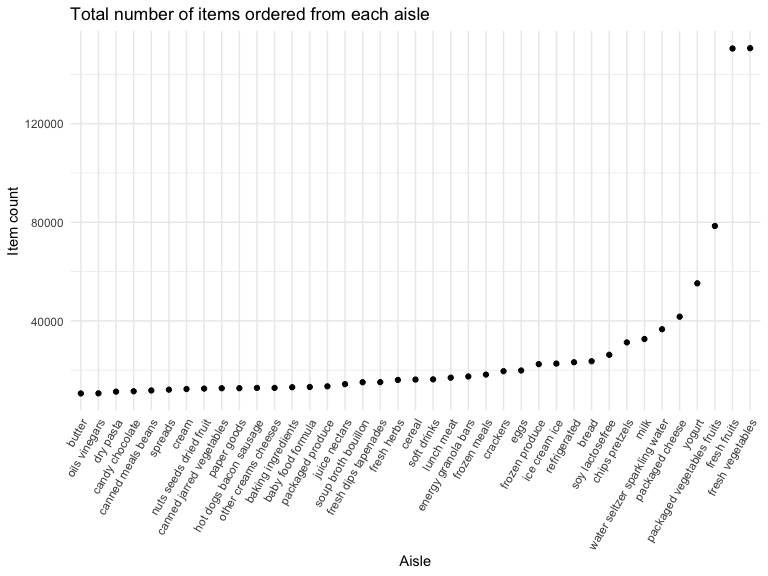

P8105 Homework 3
================
2023-10-10

This homework includes figures; the readability of embedded plots
(e.g. font sizes, axis labels, titles) will be assessed!

# Library Setup

Loading the `tidyverse` and `p8105 datasets` libraries for later use.
Also establishing some document-wide theme and visualization output
settings.

# Problem 1

## Reading in Dataset

``` r
data("instacart")

instacart = as_tibble(instacart)
```

## Describing the `instacart` dataset

The `instacart` dataset has 1384617 observations and 15 variables. It
contains information about the items in instacart orders from 131209
different individuals in 2017. The dataset includes variables with
details about the user placing the order, the date and time of the order
itself, and specifics on the items being ordered, including their name
and physical and department location in the store. In total, there are
39123 separate products included in the dataset. On average, each order
was placed 17 days after that individual’s prior order. 59.86% of
products were reordered.

## Creating Table of Most Commonly Used Aisles

To see how many aisles there are, and which aisles have the most items
ordered from them, we can create a table. Below is a table summarizing
the number of items ordered from aisle. In total, there are 134 aisles,
with fresh vegetables and fresh fruits holding the most items ordered by
far.

``` r
instacart |> 
  count(aisle) |> 
  arrange(desc(n))
```

    ## # A tibble: 134 × 2
    ##    aisle                              n
    ##    <chr>                          <int>
    ##  1 fresh vegetables              150609
    ##  2 fresh fruits                  150473
    ##  3 packaged vegetables fruits     78493
    ##  4 yogurt                         55240
    ##  5 packaged cheese                41699
    ##  6 water seltzer sparkling water  36617
    ##  7 milk                           32644
    ##  8 chips pretzels                 31269
    ##  9 soy lactosefree                26240
    ## 10 bread                          23635
    ## # ℹ 124 more rows

In total, there are 134 aisles, and the two most commonly ordered-from
aisles are fresh vegetables and fresh fruits.

## Plotting Items Ordered from Each Aisle

Now, generating a plot displaying the number of items ordered from each
aisle, limited to aisles with more than 10,000 items ordered. We can do
this by filtering the dataset based on order count. Arranging the plot
by number of orders so that the aisles generate a nice curve.

``` r
instacart |> 
  count(aisle) |> 
  filter(n > 10000) |> 
  mutate(
    aisle = fct_reorder(aisle, n)
  ) |> 
  ggplot(aes(x = aisle, y = n)) + 
  geom_point() + 
  labs(
    title = "Total number of items ordered from each aisle",
    x = "Aisle",
    y = "Item count"
  ) +
  theme(axis.text.x = element_text(angle = 60, hjust = 1))
```



As the plot reveals, the majority of aisles have less than 40,000 items
ordered, and the most popular aisles of fresh vegetables and fresh
fruits have more than 3 times that number.

## Creating Table of Popular Baking, Dog Food, and Vegetable Items

Creating a table displaying the 3 most popular items in the “baking
ingredients”, “dog food care”, and “packaged vegetables fruits” aisles,
and how often each item is ordered. Doing this by filtering to only
include items from the 3 categories of interest, then counting up how
many times each item was ordered. Then, I created a new `rank` variable
of each item’s place in the ranking for its category, and limited the
table to items with rank 1-3.

``` r
instacart |> 
  filter(aisle %in% c("baking ingredients", "dog food care", "packaged vegetables fruits")) |> 
  group_by(aisle) |> 
  count(product_name) |> 
  mutate(
    rank = min_rank(desc(n))
  ) |> 
  filter(rank < 4) |> 
  arrange(desc(n)) |> 
  knitr::kable()
```

| aisle                      | product_name                                  |    n | rank |
|:---------------------------|:----------------------------------------------|-----:|-----:|
| packaged vegetables fruits | Organic Baby Spinach                          | 9784 |    1 |
| packaged vegetables fruits | Organic Raspberries                           | 5546 |    2 |
| packaged vegetables fruits | Organic Blueberries                           | 4966 |    3 |
| baking ingredients         | Light Brown Sugar                             |  499 |    1 |
| baking ingredients         | Pure Baking Soda                              |  387 |    2 |
| baking ingredients         | Cane Sugar                                    |  336 |    3 |
| dog food care              | Snack Sticks Chicken & Rice Recipe Dog Treats |   30 |    1 |
| dog food care              | Organix Chicken & Brown Rice Recipe           |   28 |    2 |
| dog food care              | Small Dog Biscuits                            |   26 |    3 |

## Creating Table of Mean Purchase Time of Apples and Ice Cream

Making a table of the mean time when Pink Lady apples and coffee ice
cream are ordered, per day of the week. Because I want to make the table
easily readable for humans, I will use `pivot_wider` to make it “untidy”
and have each day of the week in a different column.

``` r
instacart |>
  filter(product_name %in% c("Pink Lady Apples", "Coffee Ice Cream")) |>
  group_by(product_name, order_dow) |>
  summarize(avg_hour = mean(order_hour_of_day)) |>
  pivot_wider(
    names_from = order_dow, 
    values_from = avg_hour
  ) |>
  knitr::kable(digits = 2)
```

    ## `summarise()` has grouped output by 'product_name'. You can override using the
    ## `.groups` argument.

| product_name     |     0 |     1 |     2 |     3 |     4 |     5 |     6 |
|:-----------------|------:|------:|------:|------:|------:|------:|------:|
| Coffee Ice Cream | 13.77 | 14.32 | 15.38 | 15.32 | 15.22 | 12.26 | 13.83 |
| Pink Lady Apples | 13.44 | 11.36 | 11.70 | 14.25 | 11.55 | 12.78 | 11.94 |

From the table, we can see that coffee ice cream is most often purchased
between noon and 4pm, while pink lady apples are typically ordered from
11am to 3pm.
